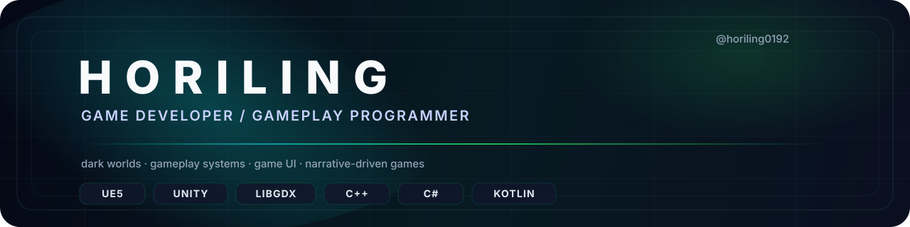

  

# HORILING
**Game Developer · Gameplay Programmer**  
*Building broken‑utopia systems, tense narratives, and dark interactive worlds.*

---

## Quick facts
- **Primary:** UE5, Unity, libGDX  
- **Languages:** C++, C# , (Kotlin, Python)  
- **Focus:** gameplay systems · UI flow · narrative tension

---

## Philosophy
I build mechanics that *carry* mood, UI that whispers, and systems that make worlds feel inevitable.

---

## What I do
### Gameplay
- player mechanics; combat prototypes; interaction logic

### Systems
- state machines; event‑driven loops; progression & prototype architecture

### UI
- HUD; menus; dialogues ; player feedback; 

---

## Current projects
### 🌆 Brothers — UE5 (Solo) — *Narrative / Urban tension*  
**Status:** active — prototyping narrative branching & C++ gameplay systems  
**Focus:** moral ambiguity, psychological pressure, UI flow.

### 🌲 Old Rus — libGDX — *2D folklore*  
**Status:** prototyping mechanics & 2D systems  
**Focus:** interaction logic, core loop, atmospheric presentation

---

## Prototypes & Demos
- **Neon Circuit (Unity):** fast gameplay loops, UI states  (prototype)
- **Ashfall Protocol (UE):** inventory flow, Blueprint interactions (prototype)

---

## Tools & Visuals
**Engines:** UE5; Unity; libGDX  
**Art / Prototyping:** Blender; Aseprite; Substance; Photoshop

---

## Contact
- **GitHub:** https://github.com/Horiling  
- **Email:** kravda2003@gmail.com

---

*If you want a short portfolio PDF, demo build, or to discuss collaboration — ping me on GitHub or email.*
